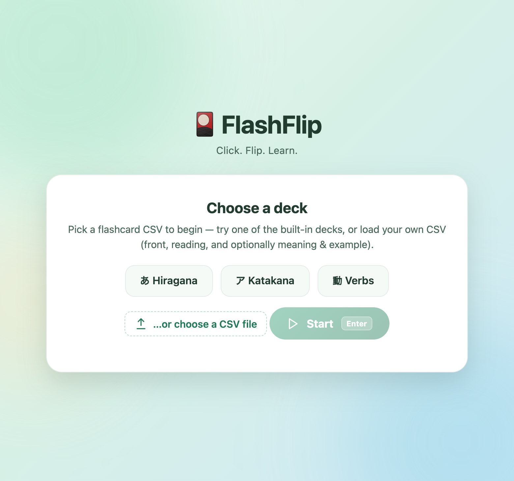
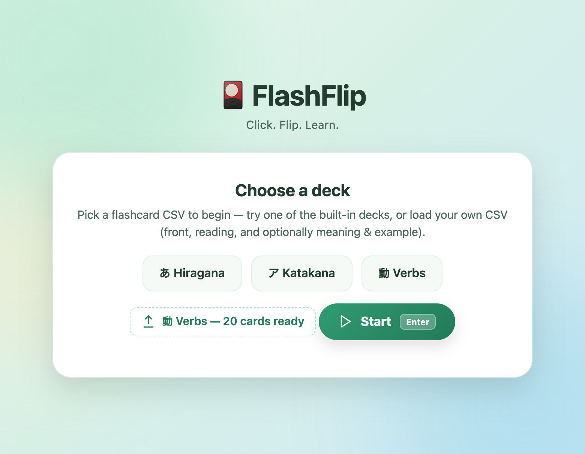
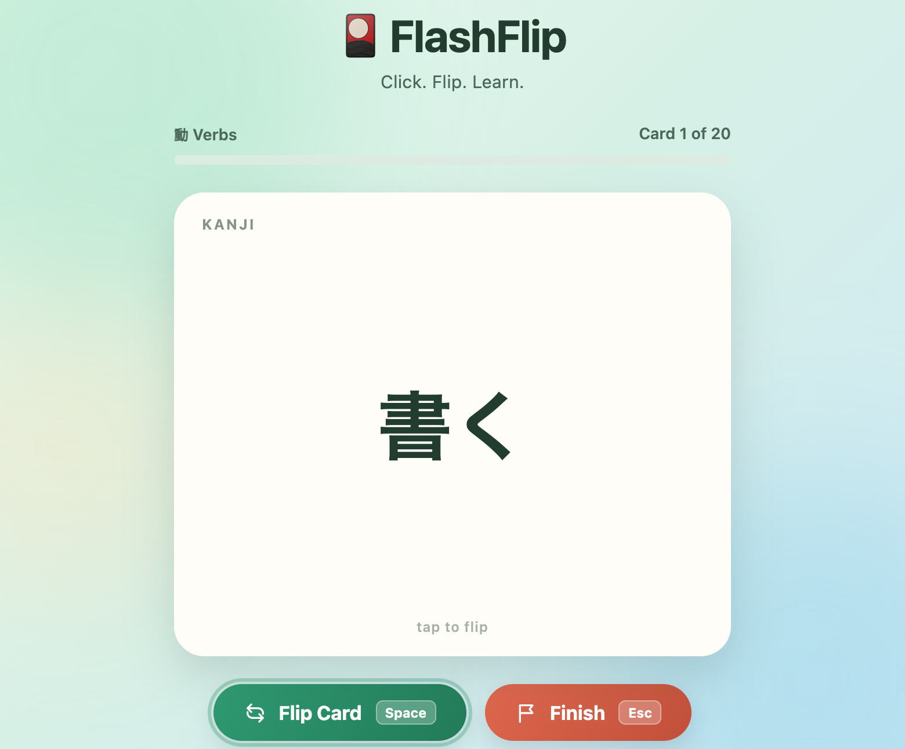
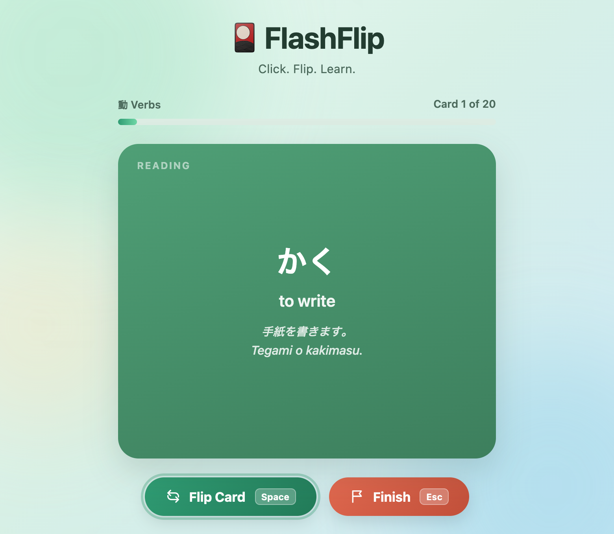
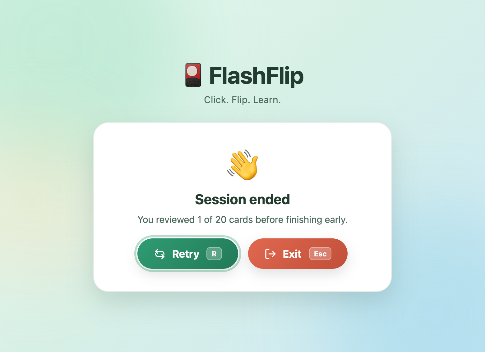

# FlashFlip

An interactive flash card app you flip through by clicking (or pressing a
key). Cards are loaded from a plain `.csv` file, so you can study the built-in Hiragana/Katakana/Verb/Adjective/Noun decks or add your own.

## How to open it

**Option A — just double-click it (simplest)**

1. Open `webapp/index.html` in your browser (double-click the file, or
   right-click → Open With → your browser).
2. On the "Choose a deck" screen, optionally pick available deck **Hiragana**, **Katakana**, **Verbs**, **Adjectives**, or **Nouns**. 
3. Click **Start** (or press `Enter`).

**Option B — run a local server (most reliable)**

From the project's root folder:

```bash
python3 -m http.server 8000
```

Then visit `http://localhost:8000/webapp/index.html` in your browser. Served
this way, the quick-deck buttons always load instantly with no file picker
needed.

## Walkthrough

A full run-through using the built-in **Verbs** deck:

|                                                                        |                                                                                      |
| ---------------------------------------------------------------------- | ------------------------------------------------------------------------------------ |
| **1. Open the app** — pick a deck                               | **2. Deck loaded, ready to start**                                             |
|                             |                        |
| **3. Click/tap the card to flip**                                | **4. Back shows Reading, Meaning, and Example**                                |
|               |  |
| **5. Finish whenever — Retry or Exit**                          |                                                                                      |
|  |                                                                                      |

## How to add words

Cards come from a CSV file with up to four columns. Only the first two are
required; the header row's text is used as the on-card label, so it can be
anything descriptive.

| Column                             | Required? | Shown as                                        |
| ---------------------------------- | --------- | ----------------------------------------------- |
| 1st (e.g. `Hiragana` / `Kanji`) | Yes       | Big text on the **front** of the card      |
| 2nd (e.g. `Reading`)              | Yes       | Big text on the **back** of the card       |
| 3rd (`Meaning`)                  | Optional  | Smaller text below the reading, if present      |
| 4th (`Example`)                  | Optional  | Small italic text below the meaning, if present |

If a row has no Meaning or Example, the back of the card looks exactly like
the simple two-column decks (just the reading, centered). If either is
filled in, it appears below the reading — this is how `data/verb.csv` shows
a full example sentence under each verb's reading and meaning.

```csv
Hiragana,Reading,Meaning,Example
あ,a,,
```

```csv
Kanji,Reading,Meaning,Example
食べる,たべる,to eat,"朝ごはんを食べます。
Asagohan o tabemasu."
```

**To add words to an existing deck:**

1. Open the deck's CSV file in `data/` (`hiragana.csv`, `katakana.csv`,
   `verb.csv`, `adjective.csv`, or `noun.csv`) in a text editor, Excel,
   Numbers, or Google Sheets.
2. Add a new row: front value, reading, and optionally a meaning and/or
   example.
3. Save the file as CSV, **UTF-8 encoded** (important for non-Latin
   characters — in Excel/Numbers pick "CSV UTF-8" from the format list).
4. Reload the app — your new row will be included.

**To make your own custom deck:**

1. Create a new CSV file anywhere, with at least the first two columns
   (header row + one row per card). Add Meaning/Example columns only if you
   want them.
2. In the app's "Choose a deck" screen, click **…or choose a CSV file**
   and select your file.

## Keyboard shortcuts

| Screen   | Key                 | Action    |
| -------- | ------------------- | --------- |
| Load     | `Enter`           | Start     |
| Play     | `Space`/`Enter` | Flip card |
| Play     | `Esc`             | Finish    |
| Complete | `R`               | Retry     |
| Complete | `Esc` / `Q`     | Exit      |
